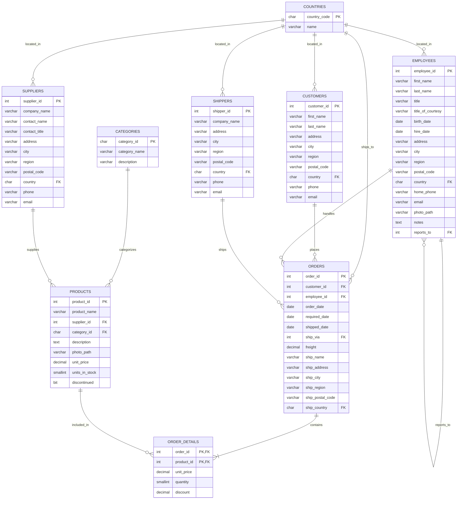

# Playground Database PostgreSQL

Playground database for PostgreSQL inspired in the Northwind database with a few modifications

## Similar Playground Databases

* [Playground Database MySQL](https://github.com/NelsonBN/playground-database-mysql)

## Scripts

* [`01-seed-gen-products.sql`](./src/01-seed-gen-products.sql) - Generates random products
* [`02-seed-gen-customer.sql`](./src/02-seed-gen-customers.sql) - Generates random customers
* [`03-seed-gen-orders.sql`](./src/03-seed-gen-orders.sql) - Generates random orders and order details

## Dataset

| Table         | Total  |
|---------------|--------|
| countries     | 249    |
| categories    | 20     |
| shippers      | 25     |
| customers     | 500    |
| employees     | 25     |
| suppliers     | 500    |
| products      | 3 746  |
| orders        | 4 935  |
| order_details | 17 385 |

## Schema

